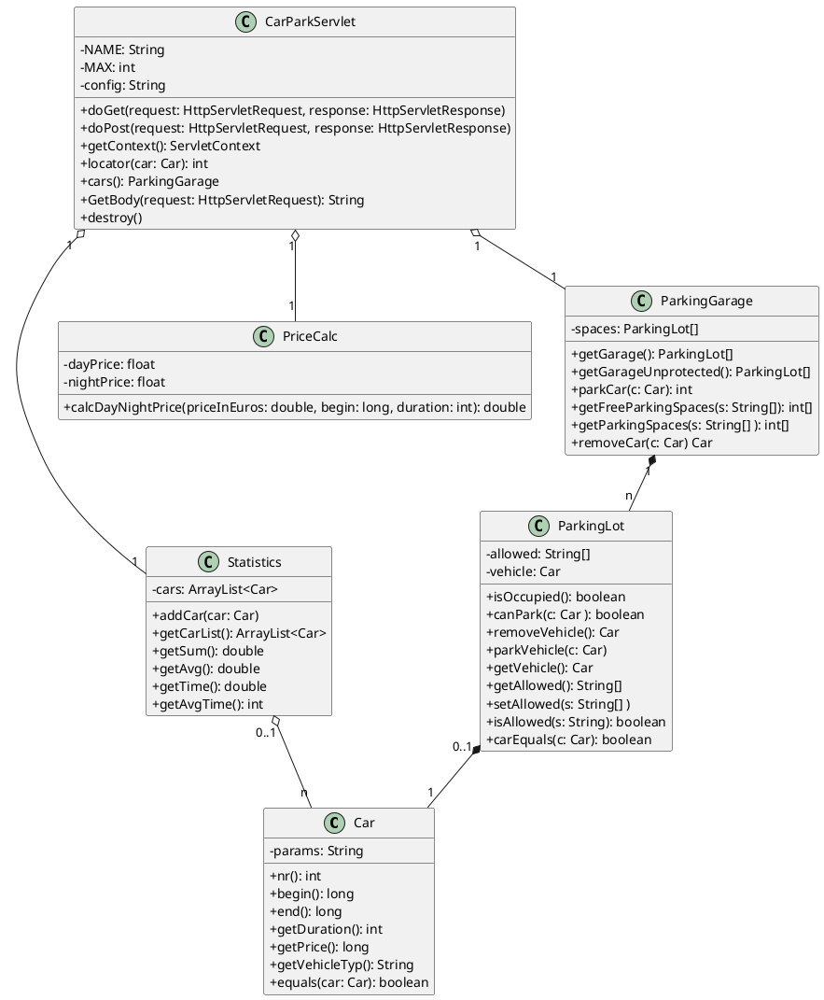

```plantuml
@startuml  
skinparam classAttributeIconSize 0  
Class Car {  
  -params: String  
  +nr(): int  
  +begin(): long  
  +end(): long  
  +getDuration(): int  
  +getPrice(): long  
  +getVehicleTyp(): String  
  +equals(car: Car): boolean  
}  
Class Statistics {  
  - cars: ArrayList<Car>  
  + addCar(car: Car)  
  + getCarList(): ArrayList<Car>  
  + getSum(): double  
   + getAvg(): double  
  + getTime(): double  
  + getAvgTime(): int  
}  
Class PriceCalc {  
  - dayPrice: float  
  - nightPrice: float  
  + calcDayNightPrice(priceInEuros: double, begin: long, duration: int): double  
}
Class ParkingGarage{  
-spaces: ParkingLot[]  
+getGarage(): ParkingLot[]  
+getGarageUnprotected(): ParkingLot[]  
+parkCar(c: Car): int  
+getFreeParkingSpaces(s: String[]): int[]  
+getParkingSpaces(s: String[] ): int[]  
+removeCar(c: Car) Car  
}  
Class ParkingLot{  
-allowed: String[]  
-vehicle: Car  
+isOccupied(): boolean  
+canPark(c: Car ): boolean  
+removeVehicle(): Car  
+parkVehicle(c: Car)  
+getVehicle(): Car  
+getAllowed(): String[]  
+setAllowed(s: String[] )  
+isAllowed(s: String): boolean  
+carEquals(c: Car): boolean   
}
Class CarParkServlet{  
-NAME: String  
-MAX: int  
-config: String  
+doGet(request: HttpServletRequest, response: HttpServletResponse)  
+doPost(request: HttpServletRequest, response: HttpServletResponse)  
+getContext(): ServletContext  
+locator(car: Car): int  
+cars(): ParkingGarage  
+GetBody(request: HttpServletRequest): String  
+destroy()  
}  
ParkingLot "0..1" *-- "1" Car
ParkingGarage"1" *-- "n" ParkingLot  
CarParkServlet "1" o-- "1" ParkingGarage
CarParkServlet "1" o-- "1" Statistics  
CarParkServlet "1" o-- "1" PriceCalc  
Statistics "0..1" o-- "n" Car
@enduml 
```
