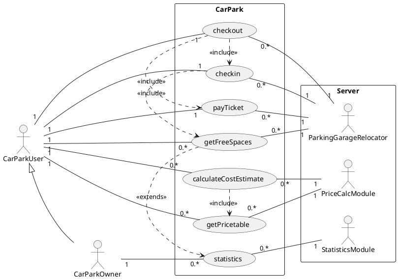

```plantuml
@startuml

left to right direction

skinparam packageStyle rectangle

actor CarParkUser

actor CarParkOwner

CarParkUser <|-- CarParkOwner

Package Server {

actor PriceCalcModule

actor  ParkingGarageRelocator

actor StatisticsModule

}

rectangle CarPark {

  CarParkUser  "1" --"1" (checkin)

  CarParkUser "1" -- "1" (checkout)

  CarParkUser "1" -- "1" (payTicket)

  CarParkUser "1" -- "0.*" (getFreeSpaces)

  CarParkUser "1" -- "0.*" (getPricetable)

  CarParkUser "1" -- "0.*" (calculateCostEstimate)

  CarParkOwner "1" -- "0.*" (statistics)

  (getPricetable) "0.*" -- "1" PriceCalcModule

  (calculateCostEstimate) "0.*" -- "1" PriceCalcModule

  (checkout) "0.*" -- "1" ParkingGarageRelocator

  (payTicket) "0.*" -- "1" ParkingGarageRelocator

  (checkin) "0.*" -- "1" ParkingGarageRelocator

  (getFreeSpaces) "0.*" -- "1" ParkingGarageRelocator

  (statistics) "0.*" -- "1" StatisticsModule

  (checkout) .> (checkin) : <<include>>

  (checkout) .> (payTicket) : <<include>>

  (checkin) .> (getFreeSpaces) : <<include>>

  (getFreeSpaces) .> (statistics) : <<extends>>

  (calculateCostEstimate) .> (getPricetable) : <<include>>

}

@enduml
```
